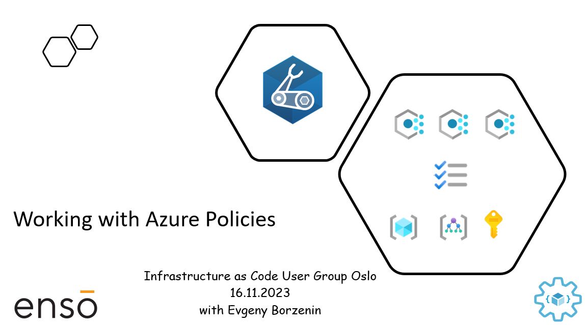

# Working with Azure Private Links

This is level 200 workshop that covers different aspects of working with [Azure Policies](https://learn.microsoft.com/en-us/azure/governance/policy/overview) where you will learn:

- What is Azure Policy
- How Azure Policy definition is structured
- What is Azure Policy Initiative
- How to assign Policy
- How to implement custom Policy
- How to programmatically create policies
- How to implement Azure Policy as Code
- What are the best practices for working with Azure Policy

and many more...

Workshop is organized as a combination of theoretical blocks with slides and hand-on labs. Estimated time for workshop completion is between 3 and 4 hours.

## Agenda

- Welcome + practical information
- Azure Policy overview (slides)
- [Lab-01](labs/lab-01/index.md) - Provision lab resources
- [Lab-02](labs/lab-02/index.md) - Assign `Require a tag on resource groups` and `Require a tag on resources` deny policies to `iac-ws7-rg` resource group
- [Lab-03](labs/lab-03/index.md) - Implement Azure policies to enforce naming convention for your Azure resources 
- [Lab-04](labs/lab-04/index.md) - Implement Azure Initiative to group naming convention policy definitions for supported resource types
- [Lab-07](labs/lab-08/index.md) - Cleaning up resources

## Prerequisites

Please spend some time before the workshop and make sure that you have installed/registered/configured all [prerequisites](./prerequisites.md).