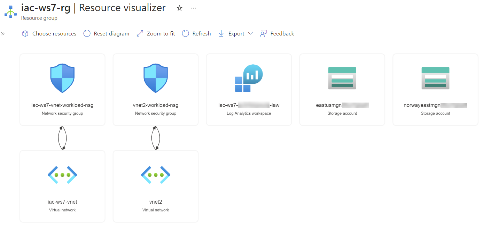

# lab-01 - provisioning of lab resources

As always, we need to provision lab environment before we can start working on the lab tasks. 

## Task #1 - provision lab resources

```powershell
# clone lab repository
git clone https://github.com/Infrastructure-AsCode/azure-policy-101

# Change directory to iac
cd .\azure-policy-101\iac\

# Deploy resources
.\deploy.ps1
```

Deployment should take less than 5 min and the following resources will be deployed under `iac-ws7-rg` resource group:



