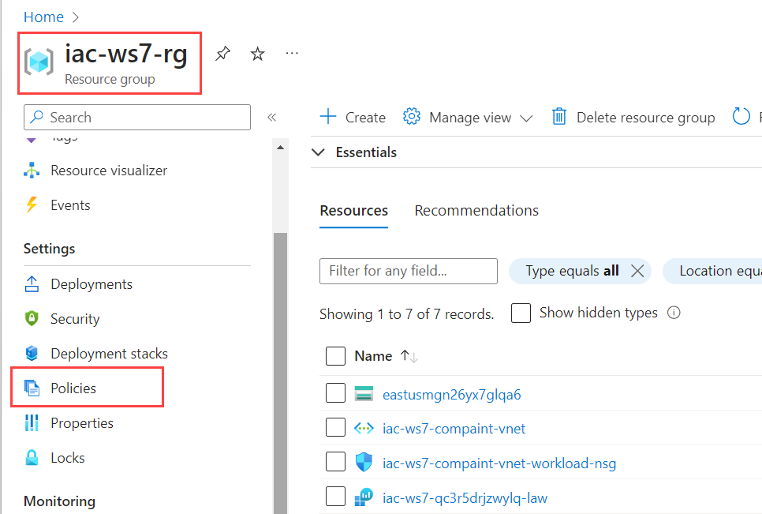

# lab-02 - assign `Require a tag on resource groups` and `Require a tag on resources` policies to `iac-ws7-rg` resource group

According to our [company policies](company-policy.md), all resources must have a `Department` tag. 
Azure already provides a policy definitions called [Require a tag on resource groups](https://www.azadvertizer.net/azpolicyadvertizer/96670d01-0a4d-4649-9c89-2d3abc0a5025.html) and [Require a tag on resources](https://www.azadvertizer.net/azpolicyadvertizer/871b6d14-10aa-478d-b590-94f262ecfa99.html) for this purpose. We just need to assign them to `iac-ws7-rg` resource group scope. 
Both policies require one parameter called `tagName` and both use policy effect `deny`, which means that if the policy is not compliant, the resource creation will be denied. 

## Task #1 - Assign `Require a tag on resource groups` policy

## Task #2 - Assign `Require a tag on resources` policy

## Task #2 - Test policy

Let's try to create a storage account without `Department` tag and check if the policy is working as expected.

```powershell
az storage account create -g iac-ws7-rg -n safoobartest
```

You should see error message similar to this one:

```json
(RequestDisallowedByPolicy) Resource 'safoobartest' was disallowed by policy. Policy identifiers: '[{"policyAssignment":{"name":"[IAC] - Require a Department tag on resources","id":"/subscriptions/.../resourceGroups/iac-ws7-rg/providers/Microsoft.Authorization/policyAssignments/1eb584cf0b424c739d8b6ddd"},"policyDefinition":{"name":"Require a tag on resources","id":"/providers/Microsoft.Authorization/policyDefinitions/871b6d14-10aa-478d-b590-94f262ecfa99"}}]'.
```

As you can see, the creation of storage account was denied.

## Task #3 - Check compliance score

Navigate to `Settings->Policies` tab of your `iac-ws7-rg` resource group.


Then click on `Compliance` tab, enter `iac` in the `Search` box and see the compliance score.


At the moment, the compliance score is 0%. The `[IAC] - Require a Department tag on resources` policy shows that there are 4 non complaint resources and `[IAC] - Require a Department tag on resources` shows that there is one non complaint resource group.