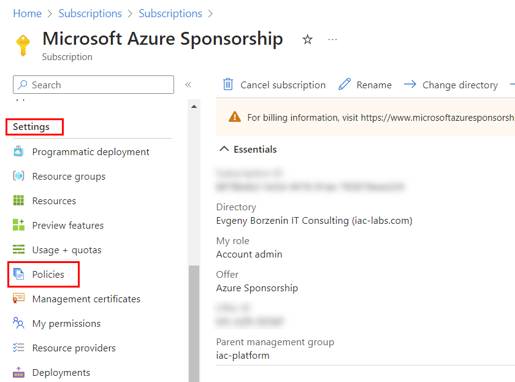
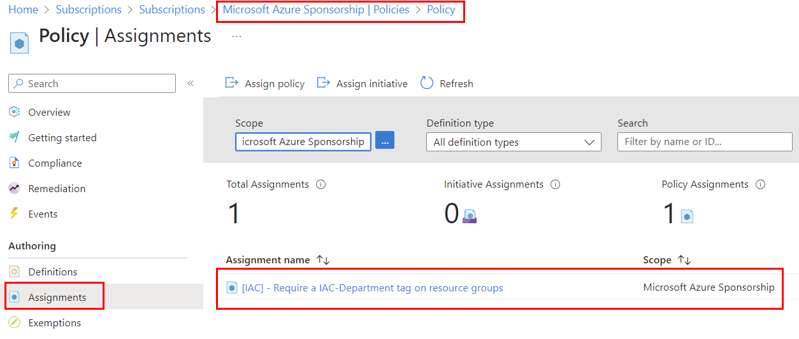
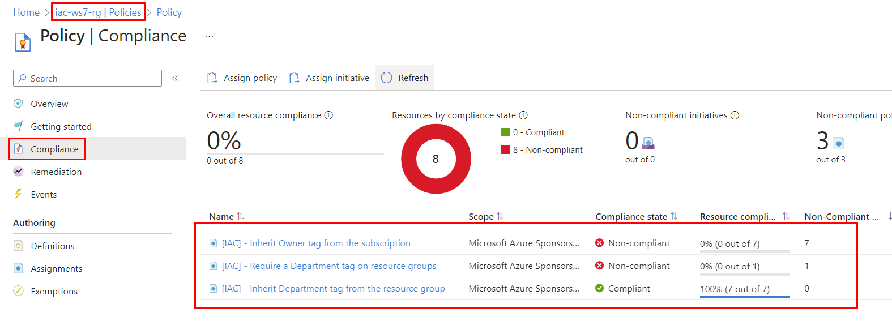

# lab-02 - create policy assignment for `Require a tag on resource groups`, `Inherit a tag from the resource group` and `Inherit a tag from the Subscription` policies at `iac-ws7-rg` resource group scope

## Task #1 - Assign `Require a tag on resource groups` policy to the scope of `iac-ws7-rg` resource group using Azure portal

According to our [company policies](../../company-policy.md), all Resource groups must have a `Department` tag. 

Azure already provides a policy definition called [Require a tag on resource groups](https://www.azadvertizer.net/azpolicyadvertizer/96670d01-0a4d-4649-9c89-2d3abc0a5025.html) for this purpose. We just need to assign it to the scope of `iac-ws7-rg` resource group. 
This policy requires one parameter called `tagName` and it uses policy effect `deny`, which means that if the policy is not compliant, the resource group creation will be denied. 

!!! info "Note"
    When you assign Azure policy, you need to decide to what scope you want to assign it to. You can assign policy to Management Group, Subscription or Resource group scope. In our case, we will assign all policies to the scope of `iac-ws7-rg` resource group.

Navigate to the `Settings->Policies` tab of your `iac-ws7-rg` resource group.



Then click on `Assign policy` button.


On the `Basic` tab, check that scope is set to `YOU-SUBSCRIPTION-NAME/iac-ws7-rg` and click on `Policy definition search` box.


On the `Available Definitions` search tab, you can either search by name or by Policy Definition ID. The best resource to find Policy Definition ID is [azadvertizer.net](https://www.azadvertizer.net/azpolicyadvertizer_all.html).

Enter `Require a tag on resource groups` in the search box and click `Add`.


This policy assignment will require that `Department` tags is present,and we want to follow our naming conventions, so let's call this assignment `[IAC] - Require a Department tag on resource groups` and goto `Parameters` tab.


This policy definition requires one parameter called `tagName`. Enter `Department` in the `Tag Name` box and click `Review + create`, check that everything looks good, and click `Create`. If there are any validation errors, fix them and try again.


After assignments are cerated, you can always find them under `Assignments` tab. Navigate to `Settings->Policies` tab of your `iac-ws7-rg` resource group and click on `Assignments` tab.



You should now see your newly created policy assignment.

## Task #2 - Test policy

Let's try to create a storage account without `Department` tag and check if the policy is working as expected.

```powershell
az storage account create -g iac-ws7-rg -n safoobartest
```

You should see an error message similar to this one:

```json
(RequestDisallowedByPolicy) Resource 'safoobartest' was disallowed by policy. Policy identifiers: '[{"policyAssignment":{"name":"[IAC] - Require a Department tag on resources","id":"/subscriptions/.../resourceGroups/iac-ws7-rg/providers/Microsoft.Authorization/policyAssignments/1eb584cf0b424c739d8b6ddd"},"policyDefinition":{"name":"Require a tag on resources","id":"/providers/Microsoft.Authorization/policyDefinitions/871b6d14-10aa-478d-b590-94f262ecfa99"}}]'.
```

As you can see, the creation of storage account was denied.

## Task #3 - Assign `Inherit a tag from the resource group` policy to `iac-ws7-rg` resource group using `az cli`

Another convention from our [company policies](../../company-policy.md) is that all resources under Resource Group should inherit tags from resource group. There are two policies that can help us with this: [Inherit a tag from the resource group](https://www.azadvertizer.net/azpolicyadvertizer/cd3aa116-8754-49c9-a813-ad46512ece54.html) and [Inherit a tag from the resource group if missing](https://www.azadvertizer.net/azpolicyadvertizer/ea3f2387-9b95-492a-a190-fcdc54f7b070.html). This is a policy with `modify` effect, which means that if resource doesn't have a tag, the policy will add it.

Let's create new policy assignment for [Inherit a tag from the resource group](https://www.azadvertizer.net/azpolicyadvertizer/cd3aa116-8754-49c9-a813-ad46512ece54.html) policy, using `az cli`. 

We need to specify the name of the Tag that we want to inherit from the resource group. In our case, it is `Department`. We also want to follow our naming conventions, therefore we call this assignment `[IAC] - Inherit Department tag from the resource group`.

[az policy assignment create](https://learn.microsoft.com/en-us/cli/azure/policy/assignment?view=azure-cli-latest#az-policy-assignment-create) command requires the following parameters:

- `--name` - name of the policy assignment
- `--display-name` - display name of the policy assignment
- `--resource-group` - the resource group where the policy will be applied. In our case, it is `iac-ws7-rg`
- `--policy` - policy name or definition ID
- `--params` - JSON formatted string with parameter values of the policy rule. In our case, we need to provide `tagName` parameter with value `Department`.
- `--mi-system-assigned` - use system assigned managed identity
- `--location` - location of the policy assignment. In our case, it is `norwayeast`

This policy is type of `Modify`. This means that it will modify resources and therefore it requires a managed identity with `Contributor` role. Therefore we need to use `--mi-system-assigned` parameter.

```powershell
# Create new policy assignment
az policy assignment create --name "[IAC] - Inherit Department tag from the resource group" --display-name "[IAC] - Inherit Department tag from the resource group" --resource-group "iac-ws7-rg" --policy
 "cd3aa116-8754-49c9-a813-ad46512ece54" --params '{\"tagName\": { \"value\": \"Department\"}}' --mi-system-assigned --location norwayeast
```

Now let's check if the policy was created successfully.

```powershell
# Get all policy assignments for iac-ws7-rg resource group
az policy assignment list -g iac-ws7-rg --query [].displayName -otsv
```

## Task #4 - Assign `Inherit a tag from the Subscription` policy to `iac-ws7-rg` resource group using `Bicep`

Yet another convention from our [company policies](../../company-policy.md) is that all resources must inherit tags from Subscription. There are two policies that can help us with this: [Inherit a tag from the subscription](https://www.azadvertizer.net/azpolicyadvertizer/b27a0cbd-a167-4dfa-ae64-4337be671140.html) and [Inherit a tag from the subscription if missing](https://www.azadvertizer.net/azpolicyadvertizer/40df99da-1232-49b1-a39a-6da8d878f469.html). This is a policy with `modify` effect, which means that if resource doesn't have a tag, the policy will add it.

Let's create new policy assignment for [Inherit a tag from the subscription](https://www.azadvertizer.net/azpolicyadvertizer/b27a0cbd-a167-4dfa-ae64-4337be671140.html) policy, using `Bicep`. This time, let's inherit `Owner` tag, therefore we call this assignment `[IAC] - Inherit Owner tag from the subscription`.

Create `assignment.bicep` file with the following content:
    
```bicep
param parPolicyAssignmentName string = '[IAC] - Inherit Owner tag from the subscription'
param parPolicyDefinitionID string = '/providers/Microsoft.Authorization/policyDefinitions/b27a0cbd-a167-4dfa-ae64-4337be671140'
param parLocation string = resourceGroup().location

resource resAssignment 'Microsoft.Authorization/policyAssignments@2022-06-01' = {
    name: parPolicyAssignmentName
    location: parLocation
    identity: {
        type: 'SystemAssigned'
    }
    properties: {
      displayName: parPolicyAssignmentName
      policyDefinitionId: parPolicyDefinitionID
      parameters: {          
        tagName: {
          value: 'Owner'
        }          
      }        
    }
}

output outAssignmentId string = resAssignment.id
```

This is `Modify` type of policy, therefore we need to configure that policy assignment should use System Assigned Managed Identity with `Contributor` role.  

Run the following command to deploy the policy assignment to `iac-ws7-rg` resource group:

```powershell
# Create new policy assignment
az deployment group create --name 'assign-policy' --resource-group 'iac-ws7-rg' --template-file assignment.bicep

# Check that assignment was created
az policy assignment list -g iac-ws7-rg --query [].displayName -otsv
```

## Task #5 - Check compliance score

Navigate to `Settings->Policies` tab of your `iac-ws7-rg` resource group.


Then click on `Compliance` tab, enter `iac` in the `Search` box and see the compliance score.



At the moment, the compliance score is 0%. The `[IAC] - Require a Department tag on resource groups` policy shows that there is is one non complaint resource group, `[IAC] - Inherit Owner tag from the subscription` shows that there are 7non complaint resources and `[IAC] - Inherit Department tag from the resource group` is 100% compliant.

