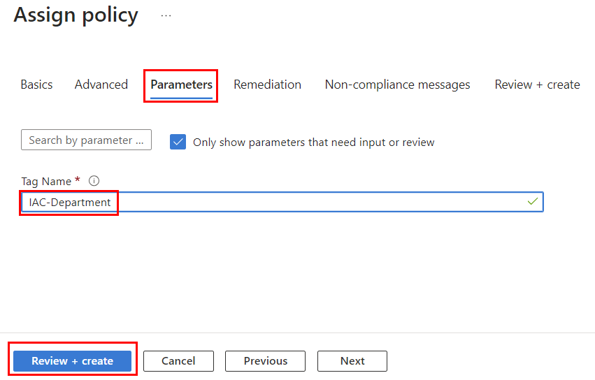

# lab-02 - create policy assignment for `Require a tag on resource groups`, `Inherit a tag from the resource group` and `Inherit a tag from the Subscription` policies at `iac-ws7-rg` resource group scope

## Task #1 - Assign `Require a tag on resource groups` policy to your subscription using Azure portal

According to our [company policies](../../company-policy.md), all Resource groups must have a `IAC-Department` tag. 

Azure already provides a policy definition called [Require a tag on resource groups](https://www.azadvertizer.net/azpolicyadvertizer/96670d01-0a4d-4649-9c89-2d3abc0a5025.html) for this purpose. We just need to assign it to your Subscription scope. 
This policy requires one parameter called `tagName` and it uses policy effect `deny`, which means that if the policy is not compliant, the resource group creation will be denied. 

!!! info "Note"
    When you assign Azure policy, you need to decide to what scope you want to assign it to. You can assign policy to Management Group, Subscription or Resource group scope. For this workshop, we will assign all policies to the scope of Subscription or `iac-ws7-rg` resource group.

Navigate to the `Settings->Policies` tab of your subscription.


Then click on `Assign policy` button.


On the `Basic` tab, check that scope is set to `YOU-SUBSCRIPTION` and click on `Policy definition search` box.


On the `Available Definitions` search tab, you can either search by name or by Policy Definition ID. The best resource to find Policy Definition ID is [azadvertizer.net](https://www.azadvertizer.net/azpolicyadvertizer_all.html).

Enter `Require a tag on resource groups` in the search box and click `Add`.


This policy assignment will require that `IAC-Department` tags is present,and we want to follow our naming conventions, so let's call this assignment `[IAC] - Require a IAC-Department tag on resource groups` and goto `Parameters` tab.


This policy definition requires one parameter called `tagName`. Enter `IAC-Department` in the `Tag Name` box and click `Review + create`, check that everything looks good, and click `Create`. If there are any validation errors, fix them and try again.



After assignments are cerated, you can always find them under `Assignments` tab. Navigate to `Settings->Policies` tab of your subscription and click on `Assignments` tab.


You should now see your newly created policy assignment.

## Task #2 - Test policy

Let's try to create new Resource group without `IAC-Department` tag and check if the policy is working as expected.

```powershell
# Create new resource group without required tags
az group create -n iac-ws7-test-rg -l norwayeast
```

You should see an error message similar to this one:

```json
(RequestDisallowedByPolicy) Resource 'iac-ws7-test-rg' was disallowed by policy. Policy identifiers: '[{"policyAssignment":{"name":"[IAC] - Require a IAC-Department tag on resource groups","id":"/subscriptions/8878beb2-5e5d-4418-81ae-783674eea324/providers/Microsoft.Authorization/policyAssignments/bc5fc9ede0044888b9bfe545"},"policyDefinition":{"name":"Require a tag on resource groups","id":"/providers/Microsoft.Authorization/policyDefinitions/96670d01-0a4d-4649-9c89-2d3abc0a5025"}}]'.
```

As you can see, the creation of resource group was denied.

Now let's try to create new Resource group with `IAC-Department` tag.

```powershell
# Create new resource group with required tags
az group create -n iac-ws7-test-rg -l norwayeast --tags IAC-Department=IaC
```
Now you should be able to create new resource group without any issues.

## Task #3 - Assign `Inherit a tag from the resource group` policy to `iac-ws7-rg` resource group using `az cli`

Next convention from our [company policies](../../company-policy.md) is that all resources deployed into Resource Group should inherit tags from resource group. There is [Inherit a tag from the resource group](https://www.azadvertizer.net/azpolicyadvertizer/cd3aa116-8754-49c9-a813-ad46512ece54.html) policy that can help us with this. This is `Modify` policy, which means that if resource doesn't have a tag, the policy will add it.

Let's create new policy assignment for `Inherit a tag from the resource group` policy, using `az cli`. This time we create assignment at the `iac-ws7-rg` resource group scope.

We need to specify the name of the Tag that we want to inherit from the resource group. In our case, it is `IAC-Department`. We also want to follow our naming conventions, therefore we call this assignment `[IAC] - Inherit Department tag from the resource group`.

[az policy assignment create](https://learn.microsoft.com/en-us/cli/azure/policy/assignment?view=azure-cli-latest#az-policy-assignment-create) command requires the following parameters:

- `--name` - name of the policy assignment
- `--display-name` - display name of the policy assignment
- `--resource-group` - the resource group where the policy will be applied. In our case, it is `iac-ws7-rg`
- `--policy` - policy name or definition ID
- `--params` - JSON formatted string with parameter values of the policy rule. In our case, we need to provide `tagName` parameter with value `IAC-Department`.
- `--mi-system-assigned` - use system assigned managed identity
- `--location` - location of the policy assignment. In our case, it is `norwayeast`

Since this is `Modify` policy and it will modify resources, it requires a managed identity with `Contributor` role. Therefore we need to use `--mi-system-assigned` parameter.

```powershell
# Create new policy assignment
az policy assignment create --name "[IAC] - Inherit IAC-Department tag from the resource group" --display-name "[IAC] - Inherit IAC-Department tag from the resource group" --resource-group iac-ws7-rg --policy  cd3aa116-8754-49c9-a813-ad46512ece54 --params '{\"tagName\": { \"value\": \"IAC-Department\"}}' --mi-system-assigned --location norwayeast
```

Now let's check if the policy was created successfully.

```powershell
# Get all policy assignments for iac-ws7-rg resource group
az policy assignment list -g iac-ws7-rg --query [].displayName -otsv
```

## Task #4 - Test policy

Let's test that policy is working as expected. 
First, let's add `IAC-Department` tag to `iac-ws7-rg` resource group.

```powershell
# Get resource group id
$rgId=$(az group show -n iac-ws7-rg --query id --output tsv)

# Add IAC-Department tag to iac-ws7-rg resource group
az tag create --resource-id $rgId --tags IAC-Department=IaC
```

Now, create any resource in `iac-ws7-rg` resource group. For example, let's cerate Managed Identity, just because it is quick to create.

```powershell 
# Create new managed identity
az identity create -g iac-ws7-rg -n iac-ws7-test-mi
```

As you can see from the output, the new managed identity inherited `IAC-Department` tag from `iac-ws7-rg`. You can also check it in the Azure portal. 


## Task #5 - Create  `Inherit a tag from the Subscription` policy assignment using `Bicep`

Yet another convention from our [company policies](../../company-policy.md) is that all resources must inherit tags from Subscription. [Inherit a tag from the subscription](https://www.azadvertizer.net/azpolicyadvertizer/b27a0cbd-a167-4dfa-ae64-4337be671140.html) policy can can be used for this us-case. As with `Inherit a tag from the resource group`, this is `Modify` policy, which means that if resource doesn't have a tag, the policy will add it.

Let's create new policy assignment for `Inherit a tag from the subscription` policy, using `Bicep`. This time, let's inherit `IAC-Owner` tag, therefore we call this assignment `[IAC] - Inherit IAC-Owner tag from the subscription`. The assignment scope for this policy is `iac-ws7-rg` resource group.

Create `assignment.bicep` file with the following content:
    
```bicep
param parPolicyAssignmentName string = '[IAC] - Inherit IAC-Owner tag from the subscription'
param parPolicyDefinitionID string = '/providers/Microsoft.Authorization/policyDefinitions/b27a0cbd-a167-4dfa-ae64-4337be671140'
param parLocation string = resourceGroup().location

resource resAssignment 'Microsoft.Authorization/policyAssignments@2022-06-01' = {
    name: parPolicyAssignmentName
    location: parLocation
    identity: {
        type: 'SystemAssigned'
    }
    properties: {
      displayName: parPolicyAssignmentName
      policyDefinitionId: parPolicyDefinitionID
      parameters: {          
        tagName: {
          value: 'IAC-Owner'
        }          
      }        
    }
}

var varContributorRoleDefinitionId = '/providers/Microsoft.Authorization/roleDefinitions/b24988ac-6180-42a0-ab88-20f7382dd24c'
resource resRoleAssignment 'Microsoft.Authorization/roleAssignments@2020-04-01-preview' = {
  name: guid(resAssignment.name, resAssignment.type)
  properties: {
    principalId: resAssignment.identity.principalId
    principalType: 'ServicePrincipal'
    roleDefinitionId: varContributorRoleDefinitionId
  }
}


output outAssignmentId string = resAssignment.id
```

This is `Modify` type of policy, therefore we need to configure that policy assignment uses System Assigned Managed Identity with `Contributor` role assigned to it.  

Run the following command to deploy the policy assignment to `iac-ws7-rg` resource group:

```powershell
# Create new policy assignment
az deployment group create --name 'assign-policy' --resource-group 'iac-ws7-rg' --template-file assignment.bicep

# Check that assignment was created
az policy assignment list -g iac-ws7-rg --query [].displayName -otsv
```

Navigate to `iac-ws7-rg->Access control (IAM)->Role assignments` tab and check `Contributor` list. You now should see that new managed identity with the same name as our policy assignment is assigned to `Contributor` role.


## Task #6 - Test policy

Let's test that policy is working as expected. 
First, let's add `IAC-Owner` tag to your subscription.

```powershell
# Get subscription id
$subscriptionId=$(az account show --query id --output tsv)
# Add IAC-Owner tag to subscription
az tag create --resource-id /subscriptions/$subscriptionId --tags IAC-Owner=JamesBond
```

Next, create another instance of Managed Identity.

```powershell 
# Create new managed identity
az identity create -g iac-ws7-rg -n iac-ws7-test1-mi
```

As you can see from the output, the new managed identity inherited both tags, `IAC-Department` from `iac-ws7-rg` resource group and `IAC-Owner` from Subscription. You can also check it in the Azure portal. 

