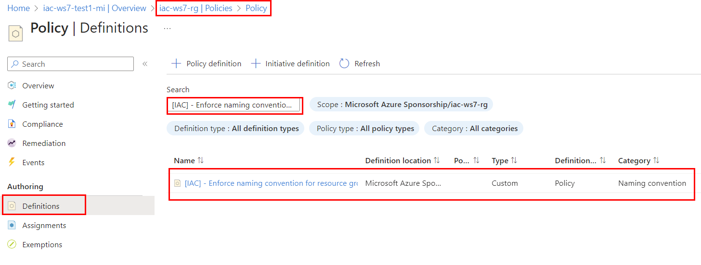

# lab-03 - implement Azure policy to enforce naming convention for your Azure resources


As part of our [company policy](../../company-policy.md), we need to enforce [naming convention](../../naming-conventions.md) for all Azure resources that we provision. It shouldn't be allowed to create resource if its name doesn't follow naming convention. There are no BuiltIn policies that enforce naming convention, so we need to create custom policy.

We can split this task in two parts:
1. Naming convention for resource groups
2. Naming convention for resources

Let's start with resource groups.

## Task #1 - create policy definition to enforce naming convention for resource groups

According to our [naming convention](../../naming-conventions.md), resource group name should start with `iac-` prefix and end with `-rg` suffix. We can create policy definition that will enforce this naming convention.

We will use Bicep to create policy definition. Create `enforce-naming-convention-rg.bicep` file with the following content:

```bicep
targetScope = 'subscription'

resource resEnforceNamingConventionResourceGroup 'Microsoft.Authorization/policyDefinitions@2021-06-01' = {
  name: 'Enforce-NamingConvention-ResourceGroup'
  properties: {
    policyType: 'Custom'
    mode: 'All'
    displayName: '[IAC] - Enforce naming convention for resource groups'
    description: 'This policy enforces a naming pattern for resource groups.'
    metadata: {
      version: '1.0.0'
      category: 'Naming convention'
    }
    policyRule: {
      if: {
        allOf: [
          {
            field: 'type'
            equals: 'Microsoft.Resources/subscriptions/resourceGroups'
          }
          {
            allOf: [
              {
                field: 'name'
                notLike: 'dashboards'
              }
              {
                field: 'name'
                notLike: 'cloud-shell-storage-*'
              }
            ]
          }
          {
            anyOf: [
              {
                field: 'name'
                notLike: '*-rg'
              }              
              {
                field: 'name'
                notLike: 'iac-*'
              }
            ]
          }
        ]
      }
      then: {
        effect: 'deny'
      }
    }
    parameters: {}
  }
}
```

Let's go through the code block by block.

```bicep
targetScope = 'subscription'
```

We want to apply this policy definition on subscription level, so we set `targetScope` to `subscription`. 

Under properties, we define policy definition name, policy type, mode, display name, description, metadata, parameters and policy rule.

This policy definition doesn't require any parameters.

Policy rule contains three rule sets:
1. If resource type is `Microsoft.Resources/subscriptions/resourceGroups`
2. If resource name doesn't start with `iac-` and doesn't end with `-rg` 
3. If resource name doesn't contain `dashboards` or `cloud-shell-storage-*`

If all three conditions are met, then effect is set to `deny`, which means that resource creation will be denied.

If we translate these rules in plain English, we get the following: 

> "If resource group name doesn't start with `iac-` and doesn't end with `-rg` then deny resource group creation. Don't apply this policy to resource groups that named `dashboards` or `cloud-shell-storage-*`."

The rule 3 is required because we don't want to deny creation of resources groups managed by Azure Portal or Azure Products, like `dashboards` and `cloud-shell-storage-*` resource groups. These resource groups are created by Azure portal and we don't have control over their names. In your environment, you might have other resource groups that you want to exclude from this policy. 

Next, Deploy policy definition by running the following command:

```powershell
az deployment sub create --template-file .\enforce-naming-convention-rg.bicep --location norwayeast
```

You can verify that policy definition was created by running the following command:

```powershell
az policy definition list --query "[?displayName=='[IAC] - Enforce naming convention for resource groups']"
# or 
az policy definition show -n Enforce-NamingConvention-ResourceGroup
```

or you can search it in the portal under `iac-ws7-rg->Settings-Policy->Definitions`. Search for `[IAC] - Enforce naming convention for resource groups` and you should see newly created policy definition.



## Task #2 - create policy assignment for `Enforce-NamingConvention-ResourceGroup` policy using Bicep

Now that we have policy definition, we need to assign it to subscription. We will use Bicep to create policy assignment. Create `enforce-naming-convention-rg-assignment.bicep` file with the following content:

```bicep
targetScope = 'subscription'

var varPolicyAssignmentName = '[IAC] - Enforce NamingConvention for ResourceGroups'

resource resEnforceNamingConventionResourceGroup 'Microsoft.Authorization/policyDefinitions@2021-06-01' existing = {
  name: 'Enforce-NamingConvention-ResourceGroup'
}

resource resAssignment 'Microsoft.Authorization/policyAssignments@2022-06-01' = {
    name: varPolicyAssignmentName    
    properties: {      
      displayName: varPolicyAssignmentName
      policyDefinitionId: resEnforceNamingConventionResourceGroup.id
      parameters: {}        
    }
}

output outAssignmentId string = resAssignment.id
```

Deploy policy assignment by running the following command:

```powershell
az deployment sub create --template-file .\enforce-naming-convention-rg-assignment.bicep --location norwayeast
```

Check that policy assignment was created:

```powershell
az policy assignment list  --query [].displayName -otsv  
```

## Task #3 - test policy 

Let's test policy assignment by creating resource group that doesn't follow naming convention. Run the following command:

```powershell
az group create --name foobar-ws7-test-rg --location norwayeast --tags IAC-Department=foobar
```
It should be denied with the following error message:

```txt
(RequestDisallowedByPolicy) Resource 'foobar-ws7-test-rg' was disallowed by policy. Policy identifiers: '[{"policyAssignment":{"name":"[IAC] - Enforce NamingConvention for ResourceGroups","id":"/subscriptions/00000000-0000-0000-0000-000000000000/providers/Microsoft.Authorization/policyAssignments/[IAC] - Enforce NamingConvention for ResourceGroups"},"policyDefinition":{"name":"[IAC] - Enforce naming convention for resource groups","id":"/subscriptions/8878beb2-5e5d-4418-81ae-783674eea324/providers/Microsoft.Authorization/policyDefinitions/Enforce-NamingConvention-ResourceGroup"}}]'.`
```

If you look closely to the output, you can also find `evaluationDetails` that shows how policy evaluated policy rules.

Check the last item in the `evaluationDetails` array. If should contain

```json 
 {
    "result": "True",
    "expressionKind": "Field",
    "expression": "name",
    "path": "name",
    "expressionValue": "iac1-ws71-rg",
    "targetValue": "iac-*",
    "operator": "NotLike"
}
```

That means that resource group name `iac1-ws71-rg` doesn't match `iac-*` pattern, so policy evaluation result is `True` and resource creation is denied.

Let's try another test-case. Run the following command:

```powershell
az group create --name iac-ws71-rg1 --location norwayeast --tags IAC-Department=foobar
```

Check the `evaluationDetails` array. 

```json
{
    "result": "True",
    "expressionKind": "Field",
    "expression": "name",
    "path": "name",
    "expressionValue": "iac-ws71-rg1",
    "targetValue": "*-rg",
    "operator": "NotLike"
}
```
The last item now shows that resource group name `iac-ws71-rg1` doesn't match `*-rg` pattern, so policy evaluation result is `True` and resource creation is denied. 

Now, let's test that policy allows resource group name from the exception list. Run the following command:

```powershell
az group create --name cloud-shell-storage-1 --location norwayeast --tags IAC-Department=foobar
```
It should allow resource group creation.

Last test-case. Run the following command:

```powershell
az group create --name iac-ws72-rg --location norwayeast --tags IAC-Department=foobar
```

It should allow resource group creation.

## Task #4 - create policy definition to enforce naming convention for resources

We can use the same logic we used for Resource groups to validate if resource name follows naming convention. That is - to check prefix and suffix of resource name. 
We can either create separate policy definition for each resource type or we can create one policy definition and use it for different resource types. 
Azure policy definitions support [input parameters](https://learn.microsoft.com/en-us/azure/governance/policy/concepts/definition-structure?ref=andrewmatveychuk.com#parameters), and we can use policy functions to reference them. There is a corresponding [strongType](https://learn.microsoft.com/en-us/azure/governance/policy/concepts/definition-structure?ref=andrewmatveychuk.com#strongtype) metadata property – `resourceTypes`, to validate inputs against existing resource types in your subscription.

Let's create "generic" policy definition that will enforce naming convention for resources. Create `enforce-naming-convention-resources.bicep` file with the following content:

```bicep
targetScope = 'subscription'

resource resEnforceNamingConventionResource 'Microsoft.Authorization/policyDefinitions@2021-06-01' = {
  name: 'Enforce-NamingConvention-Resources'
  properties: {
    policyType: 'Custom'
    mode: 'All'
    displayName: '[IAC] - Enforce naming convention for resources'
    description: 'This policy enforces a naming pattern for resources.'
    metadata: {
      version: '1.0.0'
      category: 'Naming convention'
    }
    parameters: {
      resourceType: {
        type: 'string'
        metadata: {
          displayName: 'Resource type'
          description: 'The resource type to enforce naming convention.'
          strongType: 'resourceType'
        }
      }
      resourceAbbreviation: {
        type: 'string'
        metadata: {
          displayName: 'Resource abbreviation'
          description: 'The resource abbreviation to enforce naming convention.'          
        }        
      }
    }
    policyRule: {
      if: {
        allOf: [
          {
            field: 'type'
            equals: '[parameters(\'resourceType\')]'
          }
          {
            anyOf: [
              {
                field: 'name'
                notLike: '[concat(\'*-\', parameters(\'resourceAbbreviation\'))]'
              }              
              {
                field: 'name'
                notLike: 'iac-*'
              }
            ]
          }
        ]
      }
      then: {
        effect: 'deny'
      }
    }
  }
}
```

Let's go through the code block by block.

`Enforce-NamingConvention-Resources` policy will require two parameters:
1. `resourceType` - the resource type to enforce naming convention. For example, `Microsoft.ManagedIdentity/userAssignedIdentities` or `Microsoft.Network/networkSecurityGroups`
2. `resourceAbbreviation` - resource abbreviation to enforce naming convention. For example, `mi` for Managed Identities or `nsg` for Network Security Groups

These parameters are defined under `parameters` section:

```bicep
...
parameters: {
  resourceType: {
    type: 'string'
    metadata: {
      displayName: 'Resource type'
      description: 'The resource type to enforce naming convention.'
      strongType: 'resourceType'
    }
  }
  resourceAbbreviation: {
    type: 'string'
    metadata: {
      displayName: 'Resource abbreviation'
      description: 'The resource abbreviation to enforce naming convention.'          
    }        
  }
}
...
```

Note, that `resourceType` parameter has `strongType` metadata property. This property is used to validate input parameter against existing resource types in your subscription. 

The `policyRule` section looks almost the same as for resource groups policy definition. The difference is that we use parameters values in the rule condition with  `[parameters(\'resourceType\')]` and `[parameters(\'resourceAbbreviation\')]` Bicep constructs.


Deploy policy definition by running the following command:

```powershell
az deployment sub create --template-file .\enforce-naming-convention-resources.bicep --location norwayeast
```

Check that policy definition was created:

```powershell
az policy definition list --query "[?displayName=='[IAC] - Enforce naming convention for resources']"
# or  
az policy definition show -n Enforce-NamingConvention-Resources
```

Now, let's create new `Enforce naming convention for resources` policy assignment for `Managed Identities` resource type. Create `enforce-naming-convention-mi-assignment.bicep` file with the following content:

```bicep
param parPolicyDefinitionName string = 'Enforce-NamingConvention-Resources'

var varPolicyAssignmentName = '[IAC] - Enforce NamingConvention for Managed Identity'

resource resAssignment 'Microsoft.Authorization/policyAssignments@2022-06-01' = {
    name: varPolicyAssignmentName    
    properties: {      
      displayName: varPolicyAssignmentName
      policyDefinitionId: subscriptionResourceId('Microsoft.Authorization/policyDefinitions', parPolicyDefinitionName) 
      parameters: {
        resourceType: {
          value: 'Microsoft.ManagedIdentity/userAssignedIdentities'
        }
        resourceAbbreviation:{
          value: 'mi'
        }
      }        
    }
}

output outAssignmentId string = resAssignment.id
```

This policy assignment will be deployed at the scope of `iac-ws7-rg` Resource Group. `Enforce-NamingConvention-Resources` policy definition is deployed to the scope of your subscription. To get policy definition id, we use Bicep  `subscriptionResourceId`  function.

```bicep
...
policyDefinitionId: subscriptionResourceId('Microsoft.Authorization/policyDefinitions', parPolicyDefinitionName) 
...
```

This function takes resource type and resource name parameters (`Microsoft.Authorization/policyDefinitions` and `parPolicyDefinitionName`) and it returns policy definition id.

`Enforce-NamingConvention-Resources` policy expects two parameters:
1. `resourceType` - the resource type to enforce naming convention to. In our case it is `Microsoft.ManagedIdentity/userAssignedIdentities`
2. `resourceAbbreviation` - resource abbreviation to enforce naming convention. Based on our [naming conventions](../../naming-conventions.md), Managed Identities must be suffixed with `mi`

```bicep
...
parameters: {
  resourceType: {
    value: 'Microsoft.ManagedIdentity/userAssignedIdentities'
  }
  resourceAbbreviation:{
    value: 'mi'
  }
}
...
```

Deploy policy assignment to the scope of  `iac-ws7-rg` Resource Group by running the following command:

```powershell
az deployment group create --template-file .\enforce-naming-convention-mi-assignment.bicep -g iac-ws7-rg
```

Check that policy assignment was created:

```powershell
az policy assignment list -g iac-ws7-rg --query [].displayName -otsv
```

## Task #5 - test policy

Now let's test policy assignment by creating managed identity that doesn't follow naming convention. Run the following command:

```powershell
az identity create --name foobar-ws7-test-mi --resource-group iac-ws7-rg
```

It should be denied by the `[IAC] - Enforce NamingConvention for Managed Identity`. If you check the `evaluationDetails` array, you should see the following:

```json
{
    "result": "True",
    "expressionKind": "Field",
    "expression": "name",
    "path": "name",
    "expressionValue": "foobar-ws7-test-mi",
    "targetValue": "iac-*",
    "operator": "NotLike"
}
``` 

Now, let's try to create managed identity that follows naming convention. Run the following command:

```powershell
az identity create --name iac-ws7-test2-mi --resource-group iac-ws7-rg
```

It should be allowed by the policy.

