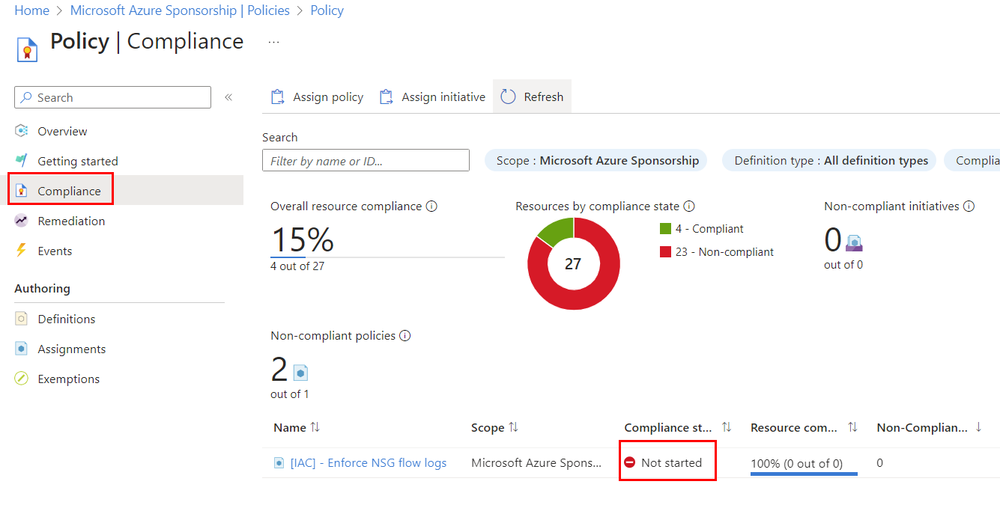
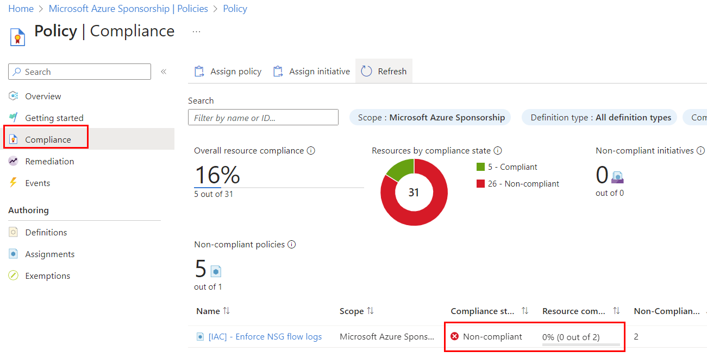
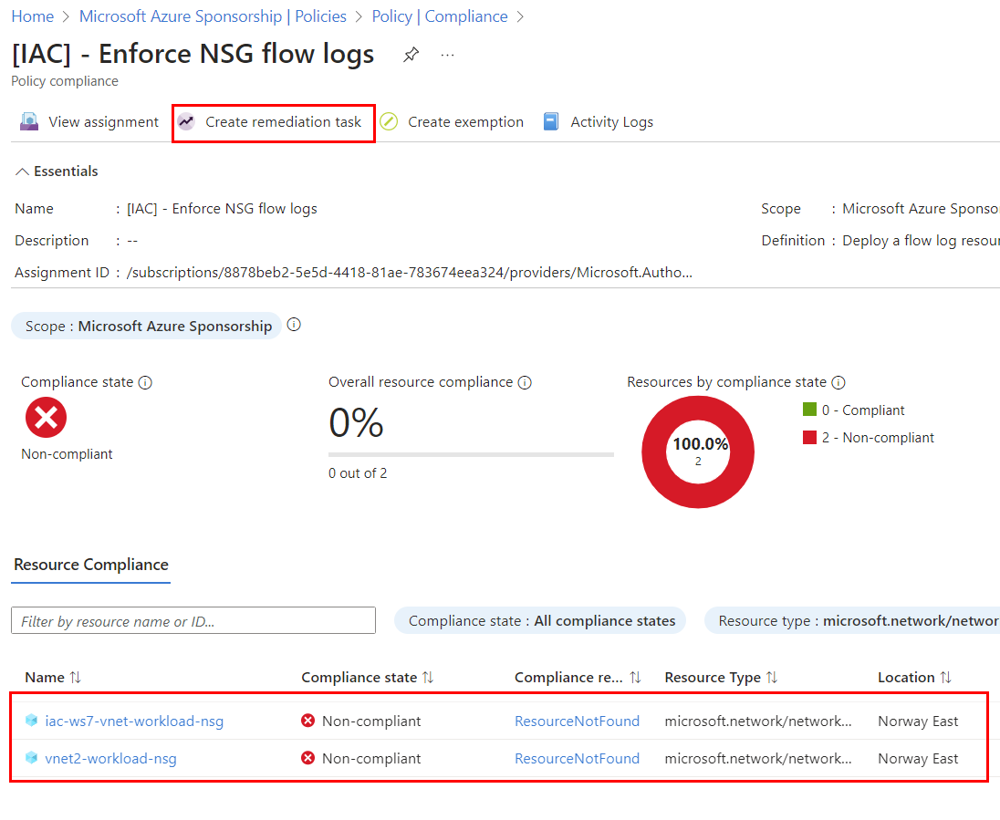
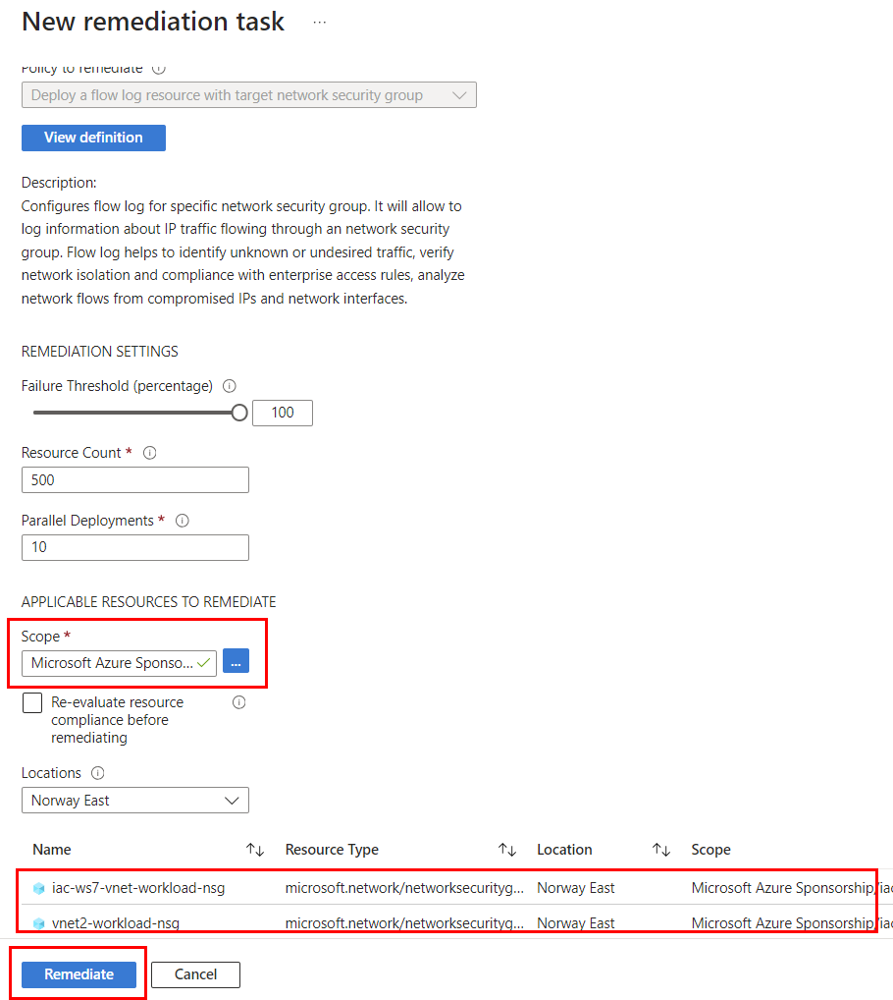
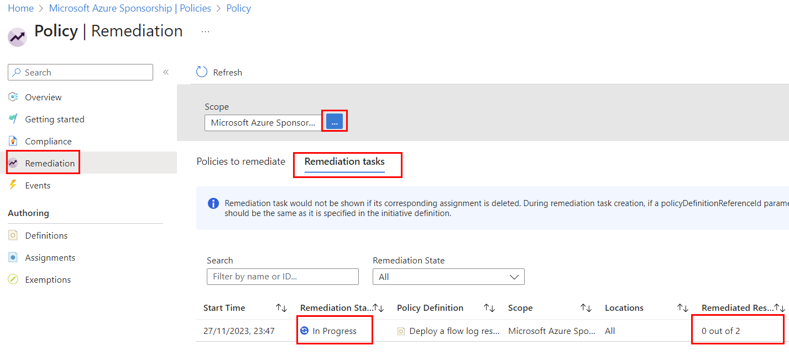
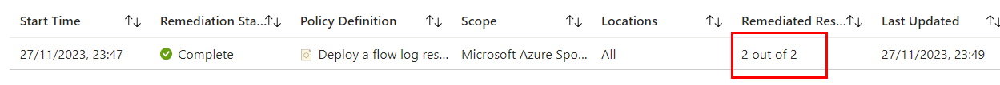
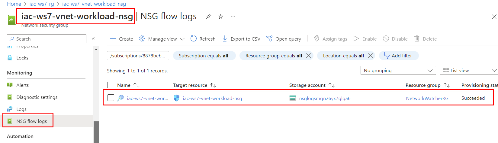
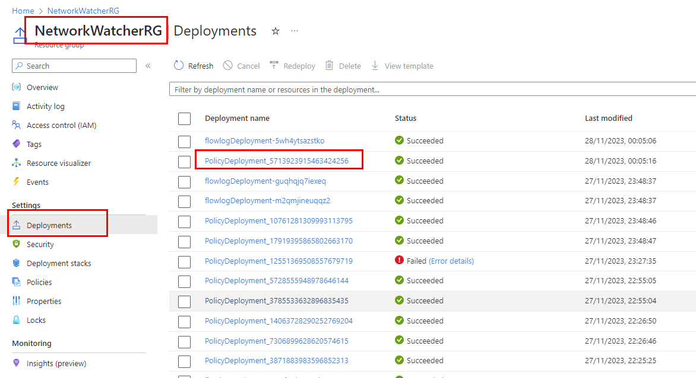
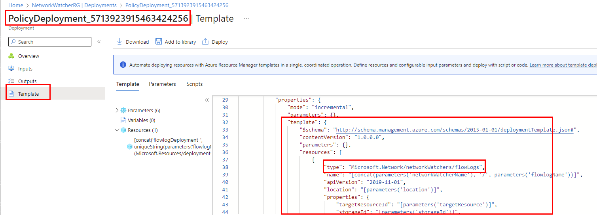

# lab-04 - Implement Deploy If Not Exists (DINE) policy for NSG flow logs

The [`deployIfNotExists`](https://learn.microsoft.com/en-us/azure/governance/policy/concepts/effects#deployifnotexists) effect makes it possible to deploy an [Azure Resource Manager template (ARM template)](https://learn.microsoft.com/en-us/azure/azure-resource-manager/templates/overview) when creating or updating a resource that isn't compliant. Policy assignments with effect set as `DeployIfNotExists` require a [managed identity](https://learn.microsoft.com/en-us/azure/governance/policy/how-to/remediate-resources) to do remediation.

## Task #1 - Deploy and configure NSG flow logs using a built-in policy

According to our [company policy](../../company-policy.md), all Network Security Groups (NSG) must have flow logs enabled and it must be deployed and configured by Azure policy. Tis way, teams owning NSG don't need to think about Flow logs configuration and Azure policy makes sure that all NSG flow logs are logged into centralices Storage Account owned by the Team Platform.  

The Built-In [Deploy a flow log resource with target network security group](https://www.azadvertizer.net/azpolicyadvertizer/0db34a60-64f4-4bf6-bd44-f95c16cf34b9.html) policy checks all existing network security groups in a scope by checking all resources of type `Microsoft.Network/networkSecurityGroups`. It then checks for linked flow logs via the flow logs property of the network security group. If the property doesn't exist, the policy deploys a flow log.

This policy requires the following parameters:
- ``nsgRegion`` - The region where the network security group is located. This Policy will review NSGs only in the selected region.
- ``storageId`` - A string with the storage id for the flowlogs to be sent to.
- ``networkWatcherRG`` - The resource group name of the network watcher. This Policy will review NSGs only in the selected resource group.
- ``networkWatcherName`` - The name of the network watcher under which the flowLog resources will be created. Make sure it belongs to the same region as the NSG

Let's create a policy assignment for `Deploy a flow log resource with target network security group` policy and deploy it to the scope of your subscription.

Create a file called `nsg-flow-logs-assignment.bicep` with the following content:

```bicep
targetScope = 'subscription'

param parPolicyAssignmentName string = '[IAC] - Enforce NSG flow logs'
param parPolicyDefinitionID string = '/providers/Microsoft.Authorization/policyDefinitions/0db34a60-64f4-4bf6-bd44-f95c16cf34b9'
param parLocation string = 'norwayeast'

var varUniqueString = uniqueString(subscription().id)
var varStorageAccountName = take('nsglogs${varUniqueString}', 24)

resource resStorageAccount 'Microsoft.Storage/storageAccounts@2023-01-01' existing = {
  name: varStorageAccountName
  scope: resourceGroup('iac-ws7-rg')
}

resource resAssignment 'Microsoft.Authorization/policyAssignments@2022-06-01' = {
    name: parPolicyAssignmentName
    location: parLocation
    identity: {
        type: 'SystemAssigned'
    }
    properties: {
      displayName: parPolicyAssignmentName
      policyDefinitionId: parPolicyDefinitionID
      
      parameters: {
        nsgRegion: {
          value: parLocation
        }
        storageId: {
          value: resStorageAccount.id
        }
        networkWatcherRG: {
          value: 'NetworkWatcherRG'
        }
        networkWatcherName: {
          value: 'NetworkWatcher_${parLocation}'
        }
      }        
    }
}

var varContributorRoleDefinitionId = '/providers/Microsoft.Authorization/roleDefinitions/b24988ac-6180-42a0-ab88-20f7382dd24c'
resource resRoleAssignment 'Microsoft.Authorization/roleAssignments@2020-04-01-preview' = {
  name: guid(resAssignment.name, resAssignment.type)
  properties: {
    principalId: resAssignment.identity.principalId
    principalType: 'ServicePrincipal'
    roleDefinitionId: varContributorRoleDefinitionId
  }
}

output outAssignmentId string = resAssignment.id
```

Note, because this is `deployIfNotExists` policy, we need assign `System Assigned Managed Identity` it with `Contributor` role. You can always find required RBAC role(s) from policy definition.

Deploy policy assignment:

```powershell
az deployment sub create --template-file .\nsg-flow-logs-assignment.bicep -l norwayeast
```

Check that policy assignment was created:

```powershell
az policy assignment show -n '[IAC] - Enforce NSG flow logs'
```

## Task #2 - run remediation task

Navigate to the `Your subscription->Policy->Compliance` and check the status of your policy assignment. If you you are fast enough, you will see that policy assignment is `Not started`. 



In this case, you should wait some minutes and refresh the page. 

Eventually, what you should ses is that policy assignment is `Non-compliant` with information about how many resources are non-compliant.



Click on the policy assignment link and you will be redirected to the page with detailed information about which resources are not  compliant and why. You can also create Remediation task from this page by clicking on `Create remediation task` button.



At the `Create remediation task` page, make sure that the scope is correct (it should be scoped to your subscription), and check that it shows resources to be remediated. Click on `Remediate` button to start remediation task.



The remediation task will start. To check the status, navigate to the `Your subscription->Policy->Remediation` and click on `Remediation tasks` tab. 



You should see that remediation task is `In progress`. If you don't see any tasks, check your scope (it should be your subscription). 

Remediation might take some minutes to complete. You can refresh the page to see the status. When it's done, the status will change to `Succeeded` and you can see how many resources were remediated.



Now, goto one of your NGSs under `iac-ws7-rg` resource group and check that flow logs are configured.



## Task #3 - test policy

Let's create new NSG and check that policy will configure flow logs for it:

```powershell
az network nsg create -g iac-ws7-rg -n 'iac-ws7-test-nsg'
```

Now we need to wait for policy to remediate the NSG. It might take up to 15-30 min before policy will start. I suggest you to move on to the next lab and check the status of the policy later.

When `DINE` policy starts, it will create regular ARM deployment. In our case, policy will deploy flowlogs into `NetworkWatcherRG` resource group. You can check the status of the deployment by navigating to the `Your subscription->NetworkWatcherRG->Deployments` and check the status of the deployment.



Deployments started by policy will be prefixed with `PolicyDeployment-` prefix. You can also check the ARM template that was used for deployment. Open latest `PolicyDeployment-xxx` deployment and navigate to the `Template` tab.



As you can see, it contains a regular ARM template that deploys `"Microsoft.Network/networkWatchers/flowLogs` resource.

## Links

- [Azure Policy overview](https://docs.microsoft.com/en-us/azure/governance/policy/overview)
- [Understand Azure Policy effects: DeployIfNotExists](https://learn.microsoft.com/en-us/azure/governance/policy/concepts/effects#deployifnotexists)
- [Azure Policy definition structure](https://docs.microsoft.com/en-us/azure/governance/policy/concepts/definition-structure)
- [Azure Policy pattern: deploy resources](https://learn.microsoft.com/en-us/azure/governance/policy/samples/pattern-deploy-resources)