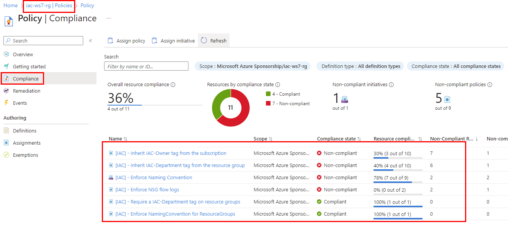

# lab-06 - Azure policy Compliance, Remediation and Exemptions

You did a good job implementing Azure Policy Governance model to support our [company policy](../../company-policy.md). 

Let's see if our resources are compliant with the policy.

## Task #1 - check policy compliance

Navigate to the `iac-ws7-rg->Policy->Compliance` and check Compliance status. You should see something similar to this (you may have different numbers)



From here we can see the status for each individual policy assignment and the total score. In my case the score is 36%, which is quite low. 

I can also see that:
- 7 out of 10 resources don't inherit `IAC-Owner` tag from subscription level
- 6 out of 10 resources don't inherit `IAC-Department` tag from resource group
- 2 out of 9 resources don't follow naming convention 

Let's try to fix it by running remediation task.

## Task #2 - remediate non-compliant resources of `[IAC] - Inherit IAC-Owner tag from the subscription` policy assignment

Resources that are non-compliant to policies with ``deployIfNotExists`` or ``modify`` effects can be put into a compliant state through Remediation. Remediation is accomplished through remediation tasks that deploy the ``deployIfNotExists`` template or the ``modify`` operations of the assigned policy on your existing resources and subscriptions, whether that assignment is on a management group, subscription, resource group, or individual resource. 

Let's start with `[IAC] - Inherit IAC-Owner tag from the subscription` policy assignment. Click on it and it will show you the detailed information about non-compliant resources.


Click on `Create remediation task` button to start remediation. At the `New remediation`, make sure that the scope is correct (it should be scoped to `iac-ws7-rg`), and check that it shows resources to be remediated. Click on `Remediate` button to start remediation task.


The remediation task will start. To check the status, navigate to the `iac-ws7-rg->Policy->Remediation` and click on `Remediation tasks` tab. If you don't see any tasks, check your scope (it should be `you subscription/iac-ws7-rg`).


Eventually, you should see that remediation task is `Succeeded` and you can see how many resources were remediated.


Go back to `iac-ws7-rg->Policy->Compliance` tab and check the status. You should see that `[IAC] - Inherit IAC-Owner tag from the subscription` assignment compliant now and the overall score increased to, in my case, 42%.


## Task #3 - remediate non-compliant resources of `[IAC] - Inherit IAC-Department tag from the resource group` policy assignment

Repeat the same exercise for `[IAC] - Inherit IAC-Department tag from the resource group` policy assignment

## Task #4 - create exemption rule for non-compliant resources

Open detailed compliance page for `[IAC] - Enforce Naming Convention` policy assignment. 


It shows that two resources don't follow naming convention. This is a typical situation when you introduce Azure policy to already existing Azure Environment. 

`[IAC] - Enforce Naming Convention` policy is `deny` policy, therefore `Create remediation task` is not available. 

Now, try to modify NSG  `vnet2-workload-nsg`, for example, by adding a tag to it:

```powershell	
az network nsg update  -g iac-ws7-rg -n vnet2-workload-nsg --tags foo=bar
```

You will not be able to update NSG, because it's name is not compliant with naming convention.

In this case, you can add new exclusion rule and exclude this resource from the policy. Click on `Create exemption` button, fill in the form and click `Review and Create`.


You can find all exemption rules under  `iac-ws7-rg->Policy->Exemptions` tab.


With exemption in place, try to add new tag to the `vnet2-workload-nsg` NSG

```powershell
az network nsg update  -g iac-ws7-rg -n vnet2-workload-nsg --tags foo=bar
```

This time, you should be able to update NSG.

Go back to `iac-ws7-rg->Policy->Compliance` tab and check the status. (Eventually) You should see that `[IAC] - Enforce Naming Convention` assignment compliant now, with a `Exempt` remark at the `Compliance state` field and the overall score increased to, in my case, 92%. We are almost there!


## Task #5 - check NSG flow logs settings of iac-ws7-test-nsg

As you remember, we cerated new `iac-ws7-test-nsg` NSG as part of `lab-05`. Now let's check if NSG flow log was configured by the `[IAC] - Enforce NSG flow logs` policy. 

Navigate to the `iac-ws7-test-nsg->Monitoring->Flow logs` and check that flow log is configured. In case it was. 


When `DINE` policy starts, it will create regular ARM deployment. In our case, policy will deploy flowlogs into `NetworkWatcherRG` resource group. You can check the status of the deployment by navigating to the `Your subscription->NetworkWatcherRG->Deployments` and check the status of the deployment.


Deployments started by policy will be prefixed with `PolicyDeployment-` prefix. You can also check the ARM template that was used for deployment. Open latest `PolicyDeployment-xxx` deployment and navigate to the `Template` tab.


As you can see, it contains a regular ARM template that deploys `"Microsoft.Network/networkWatchers/flowLogs` resource.


## Links

- [Azure Policy overview](https://docs.microsoft.com/en-us/azure/governance/policy/overview)
- [Understand Azure Policy effects: DeployIfNotExists](https://learn.microsoft.com/en-us/azure/governance/policy/concepts/effects#deployifnotexists)
- [Azure Policy definition structure](https://docs.microsoft.com/en-us/azure/governance/policy/concepts/definition-structure)
- [Azure Policy pattern: deploy resources](https://learn.microsoft.com/en-us/azure/governance/policy/samples/pattern-deploy-resources)